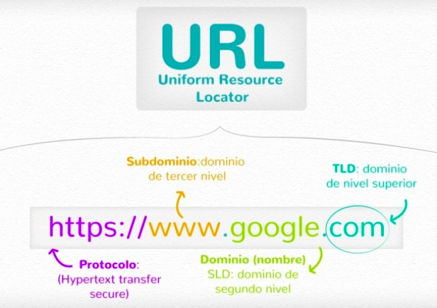
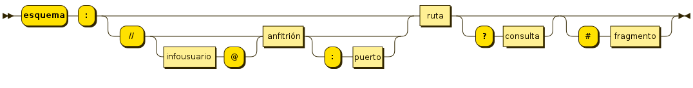
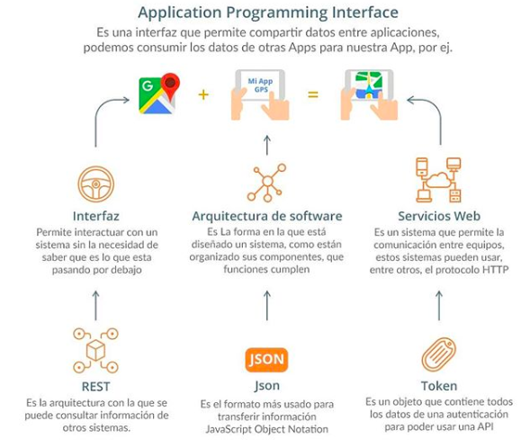

### Preguntas de Prework 

### Teoría: 

1. Haz un breve resumen sobre el protocolo HTTP y HTTPS. 
**HTTP** es un protocolo de trasferencia de hipertexto, en otras palabras podemos decir que es un protocolo de comunicación que permite la transferencia de información en Internet. Este protocolo se basa en un esquema cliente-servidor/petición/respuesta, los mensajes enviados por el cliente a través de un navegador son llamados peticiones y los mensajes de solución enviados por el servidos se llaman respuestas, en este proceso los datos que sean transferidos pueden ser interceptados por terceros. Actualmente se usa la versión 1.2, la cual permite la navegación en internet mediante una dirección URL y le da seguimiento a los enlaces establecidos. 
Se dice que **HTTP** es un protocolo "sin estado", ya que no almacena ningún tipo de información de las conexiones realizadas, es decir, una vez que el enlace finaliza los datos de navegación se pierden, sin embargo, existen unos pequeños paquetes de datos que se conocen como cookies que son  guardados en nuestro dispositivo y pueden reconocer si el usuario ya había visitado un sitio anteriormente.

Mientras que **HTTPS** es un protocolo de aplicación basado en el protocolo HTTP, destinado a la transferencia segura de datos de hipertexto, es decir, la versión segura de HTTP, este utiliza un cifrado SSL/TLS, es así que los datos viajan de forma segura.

SSL funciona así: 

- El navegador  intenta conectarse a un sitio protegido con SSL.
- El navegador solicita que el servidor web se identifique.
- El servidor envía una copia de su certificado SSL al navegador.
- El navegador comprueba si el certificado SSL es de confianza, Si es así, envía un mensaje al servidor. 
- El servidor devuelve un acuse de recibo firmado digitalmente para comenzar una sesión SSL cifrada.
- Los datos cifrados se comparten entre el navegador y el servidor.

**Datos protegidos:**

- Información de registro: nombre, dirección, email, número de teléfono.
- Información de pago: número de tarjeta de crédito, cuenta bancaria, etc.
- Formularios de inscripción.
- Documentos cargados por los clientes.

TLS ofrece tres capas de protección fundamentales: 

- Cifrado . El cifrado de los datos intercambiados los mantiene seguros de miradas indiscretas. Eso significa que mientras el usuario está navegando en un sitio web, nadie puede " escuchar" a sus conversaciones , realizar un seguimiento de sus actividades a través de múltiples páginas o robar su información.

- Integridad de los datos. Los datos no puede ser modificado o dañados durante la transferencia, intencionadamente o no, sin ser detectado.

- Autenticación. Demuestra que los usuarios se comunican con la página web deseada. Protege contra los ataques y construye la confianza del usuario, lo que se traduce en más beneficios para el negocio.

Uno de las principales aplicaciones para este protocolo (HTTPS), es para realizar transacciones de comercio electrónico. Sin embargo mas sitios de internet lo ha n incorporado como las instituciones bancarias o financieras, redes sociales como Facebook, Twitter, y toda la plataforma de Google ya trabajan con él.

2. ¿Quién is Tim Berners Lee?
Es un científico, conocido por ser el creador de la World Wide Web

3. ¿Qué signficia URL? (URL es un acrónimo)
Son las siglas en inglés de “Uniform Resource Locator”, cuyo significado en español es Localizador Uniforme de Recursos.

Es la dirección única y específica que se asigna a cada uno de los recursos que hay en Internet (sitios web, páginas web, textos, fotos, vídeos, etc) para que puedan ser localizados por el navegador y visualizados por el usuario. Por tanto, se trata de un conjunto de caracteres identificativos que poseen todos los documentos en la World Wide Web (WWW).

4. ¿Cómo se construye una URL? (podrías usar un esquema con los diferentes componentes de una URL)

1. Protocolo: HTTP (protocolo básico por el que se rigen la mayoría de las páginas) o HTTPS (protocolo de seguridad).
2. Subdominio: por lo general se ulitiza www, pero en ocasiones la dirección web la encontramos sin subdominio o encontramos otras variantes (con la finalidad de utilizarlos como un anexo del dominio principal), por ejemplo, Yahoo o Wikipedia utilizan **es**.

[https://es.yahoo.com/](https://es.yahoo.com/)

3. Dominio: hace referencia al nombre único que identifica a un sitio web.
4. TLD: extensión que acompaña al dominio, que nos indica la naturaleza del mismo. Existen niveles, dependiedo del tipo de dominio que se busca tener: 

- Dominios de nivel superior genéricos: se caracterizan por tener tres o más letras y se crearon para un tipo particular de empresas u organizaciones por ejemplo, **.com,.net, .org, .info**, etc. Por lo general se pueden usar todos exceptuando a los que son para uso exclusivo de gobiernos como .gov (es utilizado por el gobierno federal de los Estados Unidos).

- Dominios de nivel superior geográficos: están pensados para determinar el territorio al que pertenece la direcció web, se caracterizan por usar un código ISO 3166-1 del país de 2 letras, ejemplo **.gt (Guatemala), .ar (Argentina), .es(España), mx(México)**

5. ¿Qué es un Uniform Resource Identifier (URI) ?

Es una cadena de caracteres usada para identificar un recurso, ya sea por nombre (URN),locación (URL) o ambos.​ La diferencia respecto a un localizador de recursos uniforme (URL) es que estos últimos hacen referencia a recursos que, de forma general, pueden variar en el tiempo.

Un URI consta de las siguientes partes:

- Esquema: nombre que se refiere a una especificación para asignar los identificadores, e.g. urn:, tag:, cid:. En algunos casos también identifica el protocolo de acceso al recurso, por ejemplo http:, mailto:, ftp:, etc.
- Autoridad: elemento jerárquico que identifica la autoridad de nombres (por ejemplo //www.example.com).
- Ruta: Información usualmente organizada en forma jerárquica, que identifica al recurso en el ámbito del esquema URI y la autoridad de nombres (e.g. /domains/example).
- Consulta: Información con estructura no jerárquica (usualmente pares "clave=valor") que identifica al recurso en el ámbito del esquema URI y la autoridad de nombres. El comienzo de este componente se indica mediante el carácter '?'.
- Fragmento: Permite identificar una parte del recurso principal, o vista de una representación del mismo. El comienzo de este componente se indica mediante el carácter '#'.

6. Enlista y describe los métodos HTTP.
- GET: solicita una representaación de un recurso específico. Las peticiones que usan este método sólo deben recuperar datos.
- HEAD: pide una respuesta idéntica a la de una petición GET, pero sin el cuerpo de la repsuesta.
- POST: se utiliza para enviar una entidad a un recurso en específico, causando a menudo un cambio en el estado o efectos secundarios en el servidor.
- PUT: remplaza todas las representaciones actuales del recurso de destino con la carga útil de la petición.
- DELETE: borra un recurso en específico.
- CONNECT: establece un túnel hacia el servidor identificado por el recurso.
- OPTIONS: es utilizado para describir las opciones de comunicación para el recurso de destino.
- TRACE: realiza una prueba de bucle de retorno de mensaje a lo largo de la ruta al recurso de destino.
- PATCH: es utilizado para aplicar modificaciones parciales a un recurso.

7. Enlista y describe los códigos de status (o de respuesta). 
Los códigos de status más conocidos son los siguientes: 

**Respuestas informativas**
* 100 Continue: esta respuesta provisional indica que todo hasta ahora está bien y que el cliente debe continuar con la solicitud o ignorarla si ya está terminada.

**Respuestas satisfctorias**
* 200 OK: la solicitud ha tenido éxito. El significado de éxito varia dependiendo el método HTTP.

**Redirecciones**
* 300: esta solicitus tiene más de una posible repsuesta. User-Agent o el usuario debe de escoger uno de ellos. No hay forma estandarizada de seleccionar una de las respuestas.

* 301 Moved Permanently: significa que la URI  del recurso solicitado ha sido cambiado. Probablemente una nueva URI sea devuelta en la respuesta.

**Errores del cliente**
* 400 Bad Request: significa que el servidor no pudo interpretar la solicitud dada una sintaxis inválida.

* 404 Not Found: el servidor no pudo encontrar el contenido solicitado. Este código de respuesta es uno de los más famosos dada su alta ocurrencia en la web.

**Errores de servidor**
* 500 Internal Server Error: el servidor ha encontrado una situación que no sabe como manejarla.
* 503 Service Unavailable: el servidor no esta listo para manejar la petición. Causas comunes puede ser que el servidor está caido por mantenimiento o está sobrecargado. Hay que tomar en cuenta que junto con esta respuesta, una página usuario-amigable explicando el problema debe ser enviada. 

Para conocer más códigos de status consultar [Códigos de estados de respuesta HTTP](https://developer.mozilla.org/es/docs/Web/HTTP/Status).

8. ¿Qué es una query?

Una query es una pregunta o consulta. En internet, en el contexto de acciones realizadas en motores de búsqueda, se refiere a cada consulta individual que se realiza en la web.
En términos informáticos, una query es una petición precisa para obtener información en una base de datos o sistema de información. 

9. ¿Para que nos sirve emplear un header HTTP?

Nos sirve para transportar información de control entre el cliente y el servidor, como el estado de respuesta del servidor, cookies enviadas al cliente, tipo de contenido que se está enviando/recibiendo, momento en el que se realizan las solicitudes o entregas de información, etc.
Por ejemplo puede ser útil para saber qué códigos de control envia un servidor cuando se le solicita una página que no existe, y así poder asegurarse que el código de error enviado por el servidor es un 404.

10. ¿Qué es una API?

Una API es un conjunto de funciones y procedimientos que cumplen una o muchas funciones con el fin de ser utilizadas por otro software. Las siglas API vienen del inglés Application Programming Interface. En español sería Interfaz de Programación de Aplicaciones.

Una API nos permite implementar las funciones y procedimientos que engloba en nuestro proyecto sin la necesidad de programarlas de nuevo. En términos de programación, es una capa de abstracción.

Las APIs son interfaces que permiten la comunicación entre dos aplicaciones de software siguiendo cierto conjunto de reglas.

.

11. ¿Qué es JSON?
JSON (acrónimo de JavaScript Object Notation) es un formato abierto de representación e intercambio de objetos, popularizado a principios de siglo por Douglas Crockford como una alternativa ligera a XML.

Una de sus principales ventajas es que permite intercambiar datos estructurados entre diferentes programas y medios de almacenamiento independientemente del lenguaje de programación en que estén desarrollados. Además es fácil de generar y leer tanto por máquinas como por humanos.

12. ¿Qué es un endpoint (server endpoints)?

Cuando una API interactúa con otro sistema, los puntos de contacto de esta comunicación se consideran endpoint.

Visto de otra manera, cuando una API solicita información de una aplicación web o servidor web, recibirá una respuesta. El lugar donde las API envian solicitudes y dónde vive el recurso se denomina endpoint.

Los endpoint especifican dónde las API pueden acceder a los recursos y juegan un papel clave para garantizar el correcto funcionamiento del software que interactúa con él. 

En resumen, el rendimiento de la API se basa en su capacidad de comunicarse de manera efectiva con los endpoint de la API.

### Swift:

1. Realiza todos los ejemplos de [closures](https://www.hackingwithswift.com/sixty/6/1/creating-basic-closures). 
2. Realiza todos los ejemplos de [opcionales](https://www.hackingwithswift.com/sixty/10/1/handling-missing-data). 

