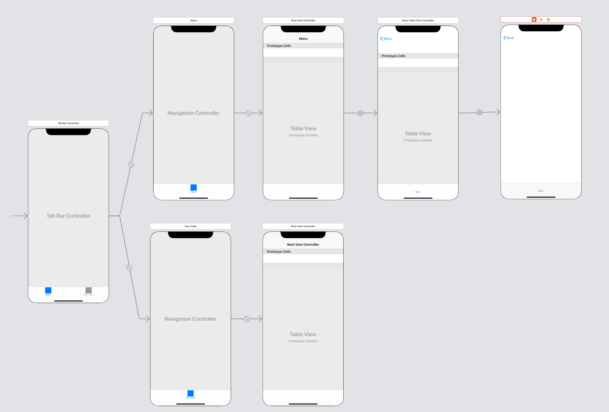

# 1. Storyboard

Creen un nuevo proyecto de Xcode usando la plantilla Single View Application. 

Antes de comenzar, es importante modificar el archivo ```Info.plist``` para agregar una nueva llave: 

* **App Transport Security Settings**
  * **AllowsLocalNetworking**
    * Type: Boolean
    * Value: YES

---

Usaremos un ```UITabBarController``` para nuestras vistas de la app. Intenten pensar por un segundo lo siguiente: ¿Qué vistas estarán en cada tab?

1. Primer vista: categorías del menú.
2. Segunda vista: lista de los items que el cliente haya agregado a la orden. 

Por lo tanto, cada vista deberá ser una subclase de ```UITableViewController```.

Construye la siguiente interfaz: 


Cada tab deberá decir: 

1. Menu
2. Tu orden

---

Ahora, ¿cómo interactuará el usuario con tu app?

Cuando la app se abra, ésta desplegará en la primer vista una lista de categorías y al dar click a cada categoría esta desplegara la lista de comidas por categoría. La segunda vista desplegará la lista de comidas pedidas. Por lo que necesitarás ¿cuántas subclases de ```UITableViewController```? -> 3. 

1. ```CategoryTableViewController```: cuando el usuario de click en una celda de esta vista, deberá cambiar a ```MenuViewController```. Por lo que necesitarás crear otra vista para modelar este funcionamiento, aplica lo aprendido en el proyecto anterior. 
2. ```MenuTableViewController```: cuando el usuario de click a una celda de esta vista, la app deberá mostrar detalles sobre la comida. Agrega un ```ViewController``` para modelar este comportamiento. Crea una clase nueva llamada ```MenuItemDetailViewController``` para esta última vista. 
3. ```OrderTableViewController```



---


